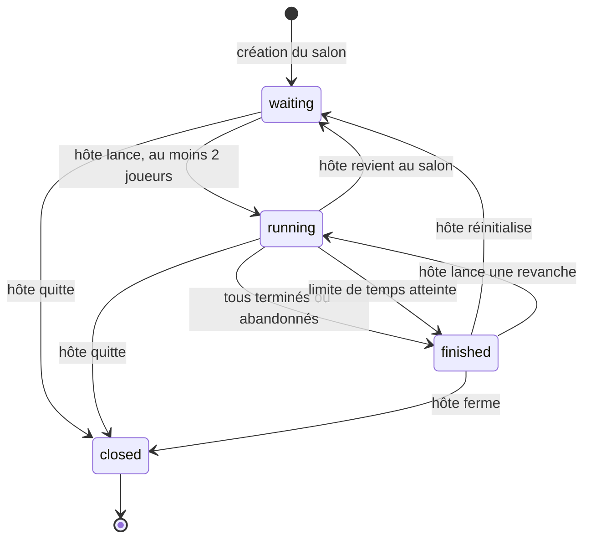

# GUÉPARD - Machine à états du salon

Ce diagramme représente les transitions réellement autorisées par le moteur. L'écran de résultats apparaît lorsque le salon est `finished`. La fermeture supprime le salon et révoque son accès ; `closed` est donc un état conceptuel, pas une valeur stockée dans `Room.phase`.

| État | Ce que voient les joueurs | Actions autorisées |
| --- | --- | --- |
| `waiting` | Participants, invitation, réglages | L'hôte modifie les paramètres, ajoute un bot, change un rôle et lance si au moins deux joueurs sont présents. |
| `running` | Pistes, texte et zone de frappe | Les joueurs tapent ou abandonnent. Un arrivant tardif devient spectateur. L'hôte peut revenir au salon. |
| `finished` | Podium, classement et statistiques | L'hôte peut lancer une revanche, réinitialiser ou fermer ; les autres peuvent quitter. |
| `closed` (conceptuel) | Salon introuvable | Aucune action sur ce salon. |

**Transitions liées aux participants :** un spectateur arrivé en cours de course devient joueur au prochain `reset`/à la revanche. Un joueur qui termine reçoit `finishedAt` ; un abandon est marqué `abandoned` et reste distinct d'une victoire. Lors d'une revanche, progrès, erreurs, saisie et classement visuel sont remis à zéro ; tous repartent en guépards.

**Synchronisation :** chaque mutation du salon augmente `revision`. Le flux SSE envoie une nouvelle vue lorsque cette révision change. La progression des bots est calculée côté serveur à partir du temps écoulé ; elle ne dépend pas de la vitesse de frappe d'un humain.

Sources : [`room-engine.ts`](../../src/server/room-engine.ts), [`Lobby.tsx`](../../src/components/lobby/Lobby.tsx), [`VisualRace.tsx`](../../src/components/lobby/VisualRace.tsx).
