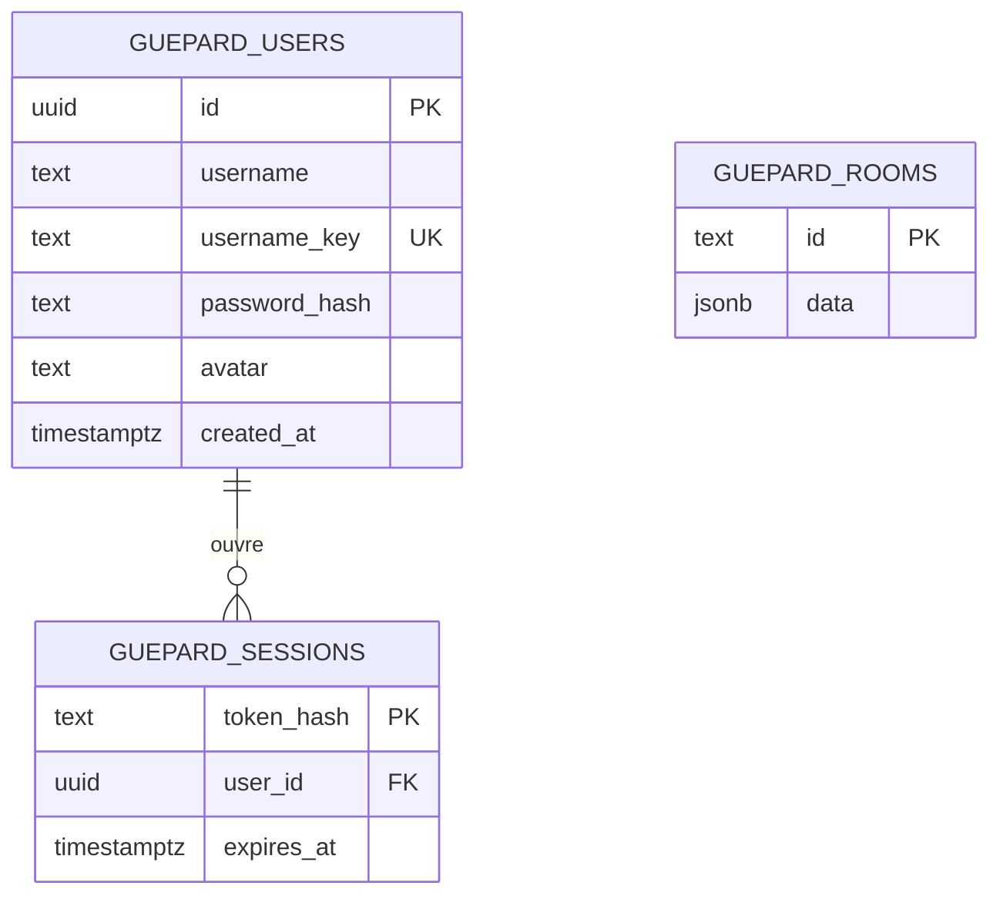
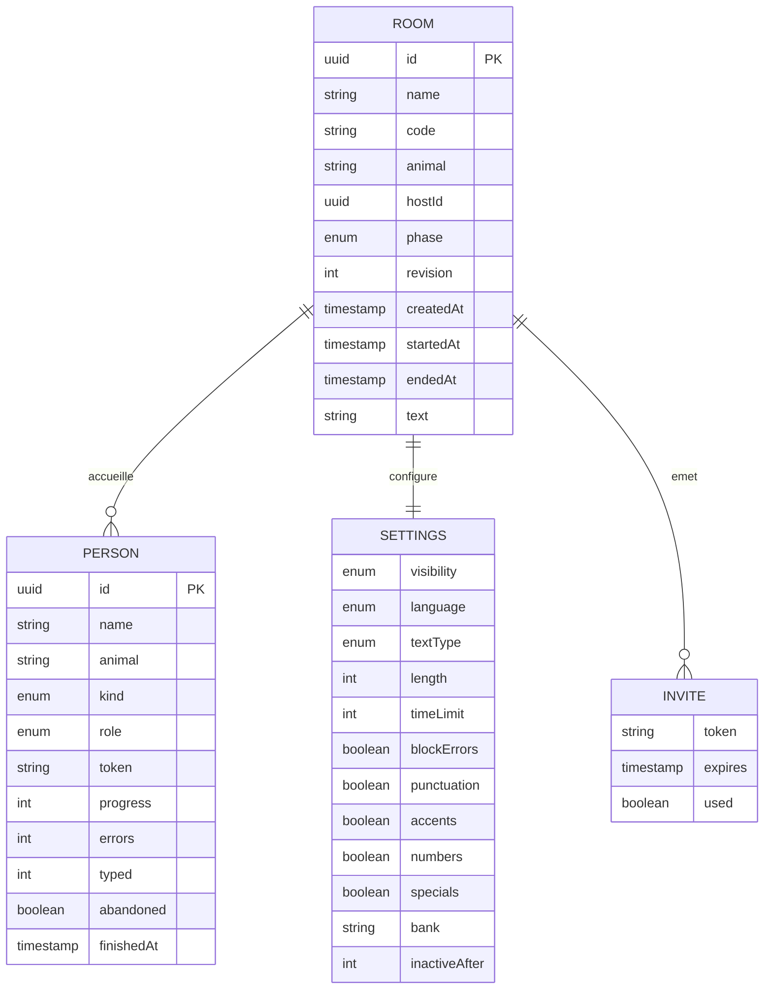

# GUÉPARD - Schéma de données

**État au 7 octobre 2026.** Le schéma sépare ce qui est physiquement dans PostgreSQL de la structure logique des salons conservée en JSONB. Il décrit l'implémentation actuelle ; il ne présente pas les statistiques locales comme des tables serveur.

## Tables PostgreSQL

`username_key` garantit l'unicité du pseudo sans tenir compte de la casse. `password_hash` contient un hachage scrypt salé. La session utilise un jeton aléatoire envoyé en cookie `HttpOnly` ; seul son hachage est enregistré dans la table. Une session expire après 30 jours. Les tables sont créées au premier accès par le serveur Next.js.

## Contenu logique de `guepard_rooms.data`

`ROOM`, `PERSON`, `SETTINGS` et `INVITE` sont des objets imbriqués dans le JSONB, **pas des tables distinctes**. La relation entre un compte et une personne du salon n'est pas une clé étrangère : le serveur reprend le pseudo et l'animal du compte lors de l'entrée, puis le salon garde un instantané de ce participant. Un invité n'a pas besoin de compte. Les spectateurs restent dans `people`, mais ne comptent pas comme concurrents.

## Vie des données et permissions

- Le serveur retire `token` des participants et `invites` avant d'envoyer un salon au navigateur. Seule la personne courante reçoit sa saisie `input` pour reprendre après reconnexion.
- Le jeton de membre du salon est distinct du cookie de compte. Il est conservé dans `sessionStorage` par navigateur et vérifié pour lire ou modifier le salon.
- Les paramètres, membres et progrès vivent dans le salon PostgreSQL. Les résultats détaillés et la heatmap d'une course restent, à ce stade, sur l'appareil du joueur ; il n'existe pas encore de table historique des courses.
- Sans `DATABASE_URL`, le mode de secours de développement utilise `.data/rooms.json`. Il n'est pas destiné à plusieurs instances serveur.

Sources de vérité : [`room-types.ts`](../../src/lib/room-types.ts), [`auth-store.ts`](../../src/server/auth-store.ts), [`room-store.ts`](../../src/server/room-store.ts), [`room-engine.ts`](../../src/server/room-engine.ts).
