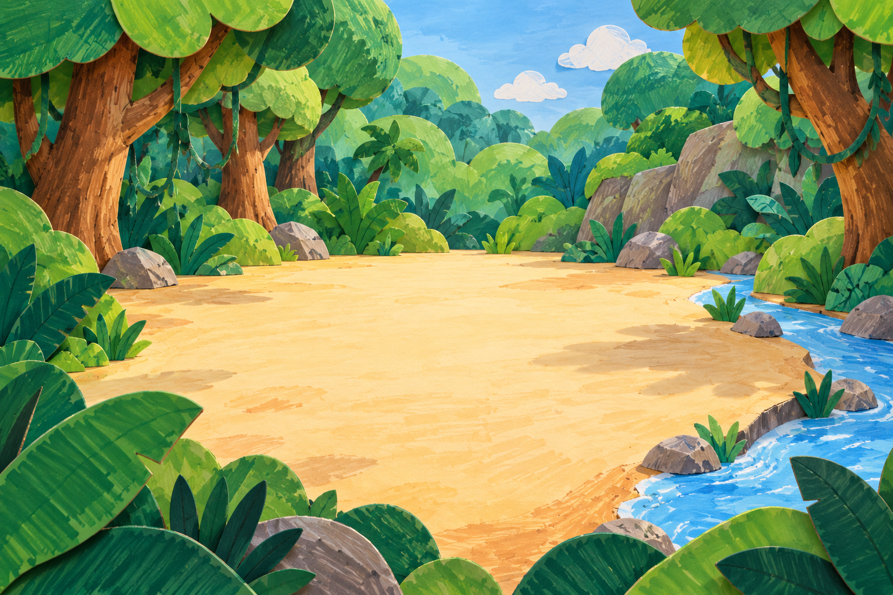
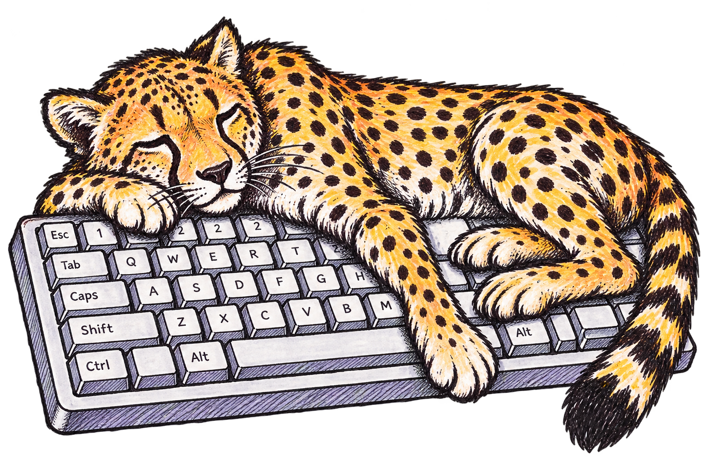
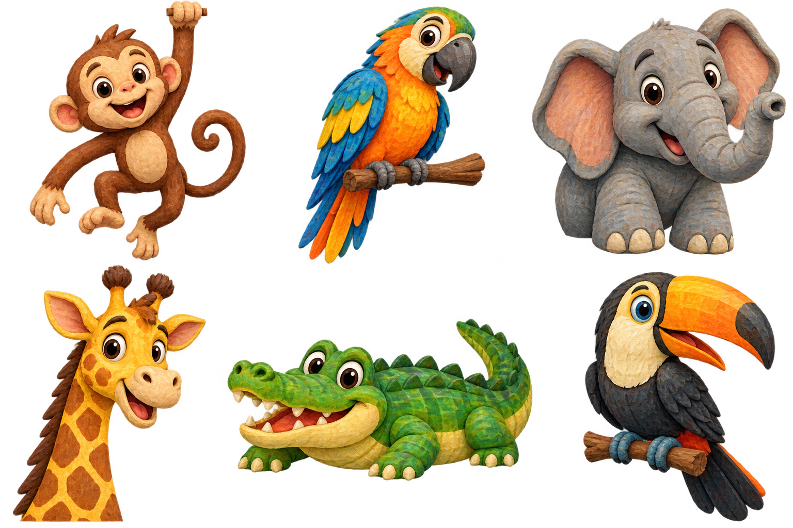
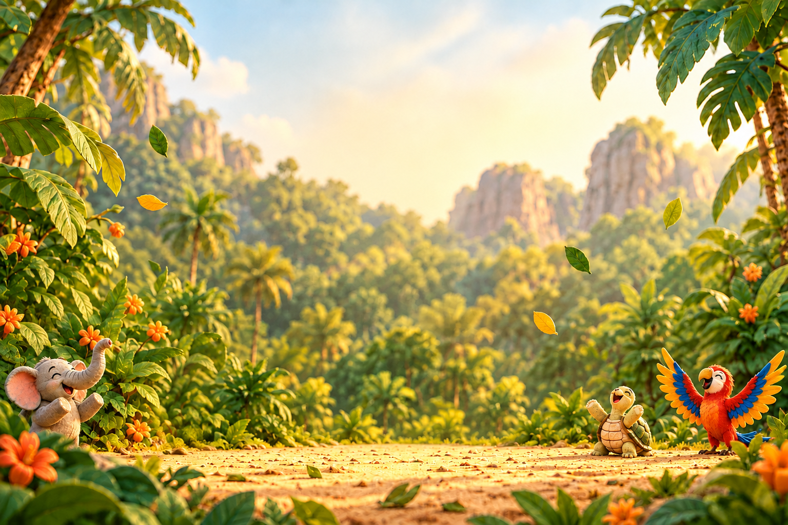

# GUÉPARD - Moodboard évolutif

[Télécharger le moodboard en PDF](moodboard.pdf)

**Direction :** une clairière illustrée, des animaux expressifs en relief 3D mat et des traces visibles de feutre. Le centre reste assez calme pour accueillir une vraie action de jeu. Ce moodboard rassemble des éléments du prototype, pas des maquettes finales figées.

| Jungle et espace de jeu | Identité |
| --- | --- |
|  |  |

| Personnages | Ambiance des résultats |
| --- | --- |
|  |  |

**Palette :** sable `#F7E7C6` · feuille `#5BAE4A` · forêt `#2F6B3D` · mangue `#F28C28` · soleil `#F6C445` · rivière `#5BC0EB`.

**Typographies du prototype :** Nunito (titres), DM Sans (interface), Kalam (accents manuscrits).

**Mots-clés :** accueillant · ludique · artisanal · clair · vivant · collectif.

**Crédit de démarche :** l'idée de l'interface et le thème ont été choisis par la porteuse du projet. ChatGPT a servi à conceptualiser et à explorer les visuels. Le design peut évoluer.

Voir la [direction artistique](direction-artistique.md) pour les intentions et les règles d'usage.
